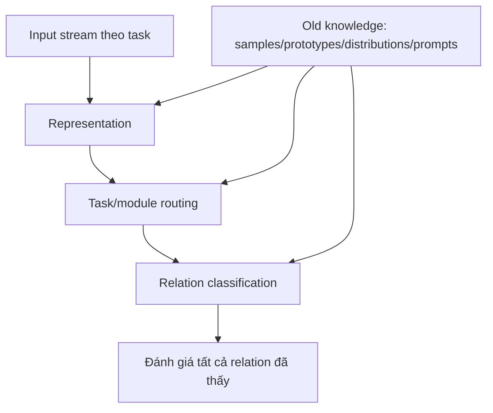

# Continual Relation Extraction

## Định nghĩa

Continual Relation Extraction (CRE) là [[Relation Extraction]] trong setting relation types xuất hiện dần theo một chuỗi task. Model phải học relation mới nhưng vẫn phân loại đúng các relation cũ mà không giả định luôn được train lại trên toàn bộ lịch sử.

## Problem formulation

Cho chuỗi task $\{T_1,\ldots,T_k\}$. Task $t$ có dataset:

$$
D_t=\{(x_i^t,y_i^t)\}_{i=1}^{N_t},\qquad y_i^t\in R_t
$$

Trong protocol của WAVE/WAVE++, relation sets không giao nhau:

$$
R_i\cap R_j=\varnothing\quad(i\ne j)
$$

Sau khi học xong task $t$, model không còn truy cập raw data của task đó và phải dự đoán trên union relation labels đã thấy:

$$
\hat R_t=\bigcup_{i=1}^{t}R_i
$$

Nguồn formulation: [[Capturing Within-Task Variance for Continual Relation Extraction with Adaptive Prompting.pdf#page=4|WAVE++ PDF, tr. 4]].

## Cách hiểu bằng lời của tôi

RE thông thường học một taxonomy relation cố định. CRE giả định taxonomy được mở rộng liên tục:

```text
đợt 1: employer, place_of_birth
đợt 2: educated_at, advisor_of
đợt 3: founded_by, subsidiary_of
```

Khi học đợt 3, model vẫn phải phân biệt cả relation của đợt 1 và 2. Context còn có thể rất giống nhau, nên chỉ nhớ topic/entity types là chưa đủ.

## Hai bài toán con

Với input thuộc task $t$:

$$
P(\hat y=y\mid x)
=P(\hat y\in R_t\mid x)
\cdot P(\hat y=y\mid \hat y\in R_t,x)
$$

1. **Task Identity Inference (TII):** relation thuộc nhóm/task nào?
2. **Within-Task Prediction (WTP):** trong nhóm đó, relation cụ thể là gì?

Phân rã này giúp chẩn đoán rõ: model sai vì chọn nhầm prompt/task hay vì representation không phân biệt được relations cùng task. Xem [[Task Identity Inference]].

## Vì sao CRE khó?

### Catastrophic forgetting

Gradient task mới làm representation/classifier bias về relation mới. Xem [[Catastrophic Forgetting]].

### Cross-task và within-task variance

- Cross-task: representations của relation thuộc các task khác nhau cần đủ tách biệt.
- Within-task: mỗi task có nhiều relation và mỗi relation có nhiều cách diễn đạt; một prompt/prototype đơn có thể quá thô.

### Context gần nhưng relation khác

Hai câu có cùng entity types và vocabulary vẫn có relation khác, ví dụ “học tại” và “hướng dẫn sinh viên tại”. Prompt routing dựa quá nhiều vào surface context dễ chọn chung experts.

### Classifier bias

Classifier vừa train trên task mới thường ưu tiên labels mới do thiếu negative evidence từ labels cũ.

### Task identity không có ở test

Task-specific module giúp isolation, nhưng nếu test không cho task ID thì hệ thống phải tự chọn module. Chọn sai tạo mismatch giữa prompt lúc train và prompt lúc inference.

## Các hướng tiếp cận trong bốn paper

| Hướng | Knowledge cũ được giữ ở đâu? | Cơ chế chính | Failure mode chính |
|---|---|---|---|
| ConPL | Vital samples + relation prototypes | Classification/distribution consistency | Buffer overfit, prototype distortion |
| CPL | Memory samples được LLM augment + prompt representation | Margin-based contrastive learning | Synthetic noise, memory/privacy cost |
| WAVE-CRE | Task prompt pools + Gaussian latent distributions | Prompt isolation + generative consolidation | Task predictor sai, shared classifier forgetting |
| WAVE++ | Prompt pools + descriptions + Gaussian distributions | Cascade voting + label anchors + latent replay | Inference cost, Gaussian/task-boundary assumptions |

## Protocol và metric cần ghi rõ

- Dataset/relation count và cách chia task.
- Số examples mỗi relation, đặc biệt task đầu tiên có thật sự few-shot không.
- Memory size trên mỗi relation và raw data có được lưu không.
- Task identity có được cung cấp ở train/test không.
- Backbone có freeze không; trainable parameter count.
- Average accuracy sau mỗi stage, forgetting theo task, nhiều random orders/runs.
- Cùng protocol giữa baselines; nếu không, số liệu không so trực tiếp được.

## Mental model thiết kế hệ thống



Mỗi cạnh là một nơi có thể quên hoặc bias. Một method mạnh thường bảo vệ nhiều cạnh, không chỉ encoder.

## Khi áp dụng

CRE phù hợp khi relation ontology mở rộng theo thời gian, annotation cũ khó lấy lại, hoặc model phải update theo domain/product releases.

Không nên gán nhãn “continual” nếu mỗi lần update vẫn trộn toàn bộ lịch sử và train lại từ đầu; đó gần incremental retraining hơn và có memory assumptions khác.

## Câu hỏi review

1. CRE thêm constraint gì so với RE thường?
2. TII và WTP khác nhau ở đâu?
3. Vì sao task-specific prompts vừa giải quyết vừa tạo thêm vấn đề?
4. Vì sao classifier cần replay dù encoder/prompts cũ được freeze?
5. NK-CRE khác một protocol có nhiều data ở task đầu như thế nào?

## Gợi ý trả lời

1. Relation labels đến tuần tự và model phải giữ labels cũ khi data cũ không còn đầy đủ.
2. TII chọn task/module; WTP chọn relation bên trong task.
3. Isolation giảm interference nhưng test phải suy đúng task để chọn prompt.
4. Shared classifier vẫn update theo labels mới và decision boundary có thể quên labels cũ.
5. NK-CRE buộc mọi task, kể cả task đầu, chỉ có $K$ examples mỗi relation nên đo đúng hơn sự kết hợp few-shot + continual.

## Liên kết

- [[Relation Extraction]]
- [[Continual Learning]]
- [[Continual Few-Shot Relation Extraction]]
- [[Catastrophic Forgetting]]
- [[Prompt Pool]]
- [[Prototype Learning]]
- [[Replay in Continual Learning]]
- [[Task Identity Inference]]
- [[Few-shot Learning]]
