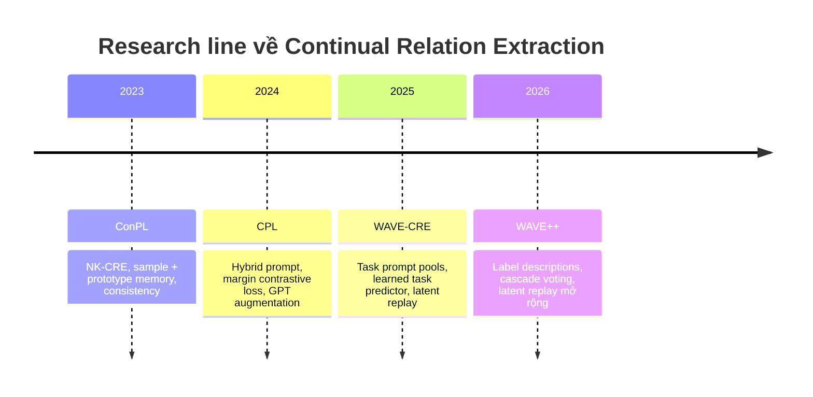

# Continual Relation Extraction: Prototype, Prompt và Replay

## Câu hỏi trung tâm

> Khi relation labels xuất hiện tuần tự và data cũ bị giới hạn, nên giữ kiến thức cũ dưới dạng sample, prototype, prompt hay latent distribution; và mỗi lựa chọn xử lý forgetting, overfitting, task routing, privacy và chi phí như thế nào?

## Bức tranh tổng quan

Bốn paper tạo thành một progression từ rehearsal dựa trên memory sang prompt-based isolation, nhưng không phải một leaderboard duy nhất:



Điểm chuyển dịch chính:

```text
raw exemplar/prototype replay
-> augmented exemplar replay
-> task-specific parameter isolation + latent replay
-> task voting + semantic label anchors + latent replay
```

Tuy nhiên, ConPL và CPL tập trung [[Continual Few-Shot Relation Extraction]], còn WAVE/WAVE++ dùng nhiều samples hơn và tập trung rehearsal-free CRE. Vì protocol khác nhau, không được so trực tiếp accuracy giữa bốn bảng.

## Các hướng tiếp cận

| Hướng | Paper liên quan | Ý chính | Cơ chế | Hạn chế |
|---|---|---|---|---|
| Prototype + episodic memory | [[20 - Research/Papers/Consistent Prototype Learning for Few-Shot Continual Relation Extraction]] | ConPL | Một exemplar + một prototype/relation; giữ classification và distribution consistency | Vẫn lưu raw sample; một prototype che multimodality; setting riêng NK-CRE |
| Prompt + contrastive + augmented replay | [[20 - Research/Papers/Making Pre-trained Language Models Better Continual Few-Shot Relation Extractors]] | CPL | Hybrid prompt tại `[MASK]`, MCL, GPT-3.5 sinh replay samples | Task đầu data-rich; GPT noise/cost; replay tăng theo relation |
| Task-specific prompt pools + latent replay | [[20 - Research/Papers/Adaptive Prompting for Continual Relation Extraction]] | WAVE-CRE | Freeze BERT/pools cũ, learned relation-level task predictor, Gaussian replay cho predictor/classifier | Task predictor vẫn quên; Gaussian đơn giản; không đo privacy |
| Prompt pools + descriptions + cascade voting | [[20 - Research/Papers/WAVE++ - Capturing Within-Task Variance for Continual Relation Extraction]] | WAVE++ | Semantic label anchors, voting không train predictor, Gaussian replay classifier | Inference chậm hơn; lưu nhiều distributions; phụ thuộc task boundaries/descriptions |

## Bảng so sánh kiến trúc

| Tiêu chí | ConPL | CPL | WAVE-CRE | WAVE++ |
|---|---|---|---|---|
| Setting chính | Mọi task N-way K-shot | Base task 100/relation, task sau K-shot | CRE 10 task | CRE 10 task |
| Backbone | BERTBASE, update | BERT-base, update qua task | Frozen BERT | Frozen BERT |
| Representation | `[MASK]` từ discrete prompt | `[MASK]` từ hybrid prompt | Entity-pair representation với prefix prompts | Entity-pair representation với prefix prompts |
| Classifier | Prototype similarity | Nearest-class-mean | Shared MLP relation classifier | Shared MLP relation classifier |
| Knowledge cũ | 1 raw exemplar + 1 prototype/relation | Real exemplars + GPT samples | Prompt pools + Gaussian query/latent stats | Prompt pools + label descriptions + Gaussian latent stats |
| Raw data cũ | Có | Có | Không | Không |
| Task inference | Không tách thành module riêng | NCM trên toàn label space | Train relation-level MLP rồi map task | Mahalanobis cascade voting |
| Replay target | Encoder/prototype geometry | Encoder/prompt representation | Task predictor + classifier | Relation classifier |
| Main anti-forgetting mechanism | Consistency + hard class focus | Prompt prior + MCL + replay | Isolation + latent consolidation | Isolation + voting + descriptions + latent consolidation |

## So sánh theo cơ chế: Prompt, Task-aware, Memory/Prototype

### 1. Prompt: đưa relation extraction về không gian PLM dễ thích nghi hơn

| Paper | Cơ chế prompt | Nó giải quyết gì? | Điểm yếu còn lại |
|---|---|---|---|
| ConPL | Discrete cloze prompt, lấy hidden state tại `[MASK]` làm relation representation. | Khai thác BERT theo dạng gần masked-language modeling; tạo representation để so với prototypes. | Prompt khá cố định; khả năng thích nghi chủ yếu đến từ prototype/memory/loss, không phải từ prompt routing. |
| CPL | Hybrid prompt gồm hard entity structure + continuous prompt vectors; bỏ verbalizer, dùng `[MASK]` embedding. | Giảm phụ thuộc label words, giúp few-shot RE gần pretraining objective hơn; ablation cho thấy prompt representation là thành phần rất lớn. | Prompt học chung vẫn có thể drift khi task mới đến; soft prompt ít mẫu dễ overfit; không tự giải quyết task routing. |
| WAVE-CRE | Task-specific prompt pool; mỗi input chọn top-K prefix experts trong pool của task. | Thay một prompt/task bằng nhiều experts để nắm within-task variance và giảm interference giữa task. | Training cần task id; inference phải suy ra đúng task/pool; một prompt pool/task làm tham số tăng theo số task. |
| WAVE++ | Giữ prompt pool, thêm label-description contrastive alignment. | Prompt không chỉ route theo input mà còn được neo bởi mô tả ngữ nghĩa của relation; cải thiện within-task prediction. | Phụ thuộc chất lượng label descriptions/Gemini; tăng inference cost qua cascade voting; chưa chứng minh với ontology/domain phức tạp. |

Kết luận ngắn: prompt trong ConPL/CPL chủ yếu là **representation interface** với PLM; prompt trong WAVE/WAVE++ trở thành **module/task memory** có routing. Đây là bước chuyển từ “prompt để biểu diễn relation” sang “prompt để lưu và chọn tri thức theo task/input”.

### 2. Task-aware: biết, đoán, hoặc né task identity

| Paper | Task-aware ở training | Task-aware ở inference | Failure mode |
|---|---|---|---|
| ConPL | Task boundary rõ; cập nhật memory sau mỗi task. | Dự đoán trên toàn bộ relation đã thấy bằng prototype similarity; không có module task predictor riêng. | Không tách được lỗi “sai task” và lỗi “sai relation trong task”; prototype gần nghĩa có thể gây nhầm. |
| CPL | Task boundary rõ; replay relation cũ sau task mới. | NCM trên toàn label space; task id không phải output trung gian. | Base task nhiều dữ liệu làm task/history prior khác ConPL; NCM phụ thuộc prototype/replay quality. |
| WAVE-CRE | Cần task id để train đúng prompt pool. | Dùng learned relation-level task predictor rồi map relation sang task/pool. | Predictor có thể quên hoặc đoán sai, kéo theo wrong pool -> wrong prompt -> wrong classifier input. |
| WAVE++ | Cần task boundary để tạo pool/statistics theo task. | Dùng cascade voting dựa trên Mahalanobis distance qua các pool/statistics. | Giảm train drift của predictor nhưng tăng inference passes; vẫn giả định relation-to-task mapping ổn định. |

Kết luận ngắn: ConPL/CPL tương đối **task-aware trong quá trình học** nhưng cố phân loại trực tiếp trên label space tích lũy; WAVE/WAVE++ biến task identity thành một nút routing rõ ràng. Research gap nằm ở chỗ các paper chưa có một cơ chế tốt cho **task-agnostic stream**, nơi boundary mơ hồ, relation có thể tái xuất hiện, hoặc task split chỉ là artefact của benchmark.

### 3. Memory/Prototype: giữ tri thức cũ bằng gì?

| Paper | Memory chính | Prototype/distribution | Đổi lại |
|---|---|---|---|
| ConPL | 1 raw exemplar + 1 prototype vector mỗi relation. | Prototype là class anchor; `L_cc` giữ sample-prototype, `L_dc` giữ relative geometry. | Vẫn lưu raw data; một prototype khó phủ class đa mode; exemplar gần center bỏ lỡ boundary cases. |
| CPL | Real exemplars + GPT-3.5 augmented samples; feature bucket trong current-task training. | NCM dùng class mean/prototype từ replay/support features. | External LLM sinh noise/cost; synthetic samples có thể leak prior ngoài benchmark; task đầu data-rich làm kết quả khó so với all-shot setting. |
| WAVE-CRE | Không lưu raw examples; lưu prompt pools và Gaussian query/latent stats. | Gaussian theo relation cho task predictor và classifier replay. | Không phải zero-memory; Gaussian đơn có thể yếu với distribution đa mode; privacy chưa được kiểm chứng. |
| WAVE++ | Prompt pools + label descriptions + Gaussian latent stats. | Mahalanobis voting và latent replay dùng mean/covariance. | Memory/statistics tăng theo relation/pool; Gaussian validation còn hẹp; label descriptions là một dạng external semantic memory. |

Kết luận ngắn: bốn paper đều cần một dạng memory. Khác nhau không phải “có memory hay không”, mà là **memory nằm ở dữ liệu thô, prototype vector, generated text, prompt parameters, hay latent statistics**. Vì vậy các claim như `rehearsal-free` nên đọc là `raw-data-free`, không phải không replay hoặc không lưu thông tin quá khứ.

## Protocol: vì sao không được so accuracy ngang hàng?

| Paper | Task split | Few-shot assumption | Metric/runs | Memory assumption |
|---|---|---|---|---|
| ConPL | FewRel 8×10 relations; TACRED 8 task | Mọi task K-shot | Whole accuracy; 6 task sequences | 1 sample + 1 vector/relation |
| CPL | 8 task | Task đầu 100/relation; task sau 5/10-shot | Strict overall accuracy; 6 rounds | $L$ real exemplars + synthetic data |
| WAVE-CRE | FewRel/TACRED chia 10 task | Không phải few-shot protocol chính | Mean accuracy; 5 seeds | Không raw samples; Gaussian stats/prompt pools |
| WAVE++ | FewRel/TACRED chia 10 task | Không phải few-shot protocol chính | Mean accuracy; 5 runs | Không raw samples; nhiều Gaussian stats/prompt pools |

Các khác biệt làm số tuyệt đối không cùng nghĩa:

- ConPL task đầu cũng K-shot; CPL task đầu có 100 samples/relation.
- WAVE dùng 10 stages, ConPL/CPL dùng 8.
- Memory budgets và backbone update khác.
- Một số baseline numbers là re-run, số khác lấy từ paper trước.
- TACRED preprocessing có thể bỏ `no_relation` hoặc giới hạn samples khác nhau.

## Kết quả nên giữ — chỉ so trong từng paper

### ConPL

- FewRel 10-way 5-shot, $T_8$: 85,77; hơn EMAR(PT) 4,43 điểm.
- TACRED 5-way 5-shot, $T_8$: 76,38; hơn EMAR(PT) 7,71 điểm.
- Bỏ loss tập trung confusing prototypes làm FewRel $T_8$ giảm 10,66 điểm — contribution lớn nhất.
- Mean forgetting 3,31, gần JointTrain 3,29 trong protocol paper.

### CPL

- $T_8$ 5-shot: 64,50 FewRel và 57,39 TACRED.
- Hơn SCKD 1,63 điểm trên FewRel, 6,28 trên TACRED.
- Bỏ prompt representation giảm 13,41/14,78 điểm — component lớn nhất.
- Bỏ GPT generation chỉ giảm 0,72 trên FewRel nhưng 6,76 trên TACRED — augmentation rất dataset-dependent.

### WAVE-CRE

- $T_{10}$: 85,0 FewRel, 78,7 TACRED.
- Hơn best rehearsal-free baseline trong bảng 17,8 và 6,1 điểm.
- Gần rehearsal-based SOTA: +0,2 trên FewRel, −0,4 trên TACRED.
- Prompt pool hơn một prompt/task 1,8 điểm ở TACRED task-incremental $T_{10}$.

### WAVE++

- $T_{10}$: 87,7 FewRel, 82,5 TACRED.
- Hơn WAVE-CRE 2,7 và 3,8 điểm; hơn EoE 2,2 và 1,0 điểm.
- Bỏ prompt pool giảm 1,3/1,4 điểm; bỏ descriptions giảm 1,9/1,8.
- Bỏ latent generative replay giảm 25,6/22,2 điểm — shared classifier consolidation là thành phần quyết định trong framework.

## Điểm đồng thuận

### 1. Forgetting không chỉ nằm ở encoder

Prototype, classifier, prompt/router và task predictor đều có thể quên hoặc mất hiệu lực. Một method chỉ freeze backbone chưa đủ.

### 2. Một memory summary duy nhất thường quá hẹp

- Một exemplar không phủ class distribution.
- Một prototype không nắm nhiều modes.
- Một prompt/task không nắm within-task variance.
- Một Gaussian/relation có thể quá đơn giản.

Các paper lần lượt thêm prototype, augmentation, prompt pool hoặc covariance để tăng độ phủ.

### 3. Relations gần nghĩa cần objective tập trung boundary

ConPL dùng confusing prototypes; CPL dùng margin-based contrastive learning; WAVE++ dùng label-description contrastive alignment. Cả ba đều cố tránh representation chỉ học surface context.

### 4. Replay vẫn rất mạnh

Ngay trong prompt-based systems, latent replay là yếu tố lớn nhất bảo vệ shared classifier. Parameter isolation và replay giải quyết hai tầng khác nhau, không phải hai lựa chọn loại trừ nhau.

### 5. Evaluation protocol là một phần của đóng góp

NK-CRE chỉ ra base task data-rich có thể làm CFRE benchmark lạc quan. WAVE++ tách TII/WTP và báo task prediction. Cách định nghĩa task/memory quan trọng ngang với model architecture.

## Điểm còn tranh luận

### “Rehearsal-free” nghĩa là gì?

WAVE/WAVE++ không lưu raw examples nhưng sample synthetic latent representations. Cách gọi chính xác hơn:

```text
raw-data-free replay / no exemplar buffer
```

không phải zero-memory hoặc hoàn toàn không replay.

### Prototype center hay boundary samples?

ConPL chọn exemplar gần center để ổn định; nhưng hard/boundary examples mới giàu thông tin phân biệt class. Có thể cần memory kết hợp center + boundary + diversity thay vì một tiêu chí.

### LLM augmentation có thực sự tạo knowledge mới?

CPL cho lợi ích lớn trên TACRED nhưng nhỏ trên FewRel và giảm khi sinh quá nhiều. Generated text có thể chỉ tạo lexical variants, hoặc đổi head-tail semantics. Cần filter/entailment checks và cost report.

### Gaussian latent distributions có đủ không?

WAVE++ có kiểm tra normality trên tám class của một FewRel task, chưa đủ cho toàn benchmark. Multimodal distributions hoặc covariance kém điều kiện có thể cần mixture/non-parametric replay.

### Task identity là class có semantics hay artefact của split?

WAVE-CRE tránh task-class MLP bằng relation-level predictor; WAVE++ bỏ predictor, dùng distances/votes. Cả hai vẫn giả định relation-to-task mapping ổn định và task boundaries rõ khi train.

## Khoảng trống nghiên cứu

### Research gap tiềm năng từ bốn paper

1. **Task-agnostic continual relation extraction:** các paper vẫn dựa nhiều vào task boundary rõ. Một hướng tốt là thiết kế router hoặc objective không cần oracle task id khi train, chịu được relation tái xuất hiện, task overlap và open-set/no_relation.
2. **Memory frontier công bằng theo bytes và rủi ro privacy:** hiện chưa so cùng ngân sách giữa raw exemplars, prototypes, prompt pools, Gaussian stats và generated samples. Gap là benchmark tính cả memory bytes, inference latency, API calls, và rủi ro membership/reconstruction.
3. **Multi-modal hoặc boundary-aware prototypes:** ConPL cho thấy prototype consistency hữu ích, nhưng một prototype/relation quá nghèo. Có thể nghiên cứu memory gồm center + boundary + diversity prototypes, hoặc mixture prototypes có ràng buộc forgetting.
4. **Latent replay phi Gaussian và có kiểm định:** WAVE/WAVE++ phụ thuộc Gaussian stats nhưng validation còn hẹp. Gap tự nhiên là mixture density, non-parametric replay, normalizing flow, hoặc distribution-free coreset trong latent space, đi kèm test normality/robustness theo từng relation.
5. **LLM-generated semantic anchors có kiểm soát:** CPL và WAVE++ đều dùng external semantic signal, qua GPT augmentation hoặc Gemini label descriptions. Gap là cơ chế kiểm chứng generated data/descriptions bằng entailment, directionality, entity-type constraints, provenance và cost/variance report.

### Chuẩn hóa evaluation

- Một benchmark chung gồm all-task few-shot và non-few-shot variants.
- Cùng task orders, backbones, memory bytes và raw-data policy.
- Báo accuracy, macro-F1, forgetting/BWT, calibration, old/new split, variance/significance.
- Tính synthetic samples, prompt parameters, distribution stats và API calls vào budget.

### Boundary-free và overlapping relations

Các paper giả định task boundaries/relation sets rõ, thường disjoint. Hệ thực tế cần:

- phát hiện shift/task online;
- relation tái xuất hiện ở task sau;
- unknown/no_relation/open-set rejection;
- ontology merge/split/rename.

### Privacy thật sự

Không lưu raw data chưa đủ. Cần:

- membership inference/reconstruction từ prompts/prototypes/Gaussian stats;
- privacy budget hoặc differential privacy;
- policy khi gửi exemplars sang external LLM.

### Memory/latency scaling

- Prompt pool mỗi task tăng parameters.
- Cascade voting tăng inference passes.
- Gaussian stats theo relation/pool có thể tăng nhanh.
- Replay toàn bộ relation làm training càng muộn càng nặng.

Cần curves theo hàng trăm task, không chỉ 8–10.

### Generalization ngoài hai benchmarks

- Multilingual/cross-lingual RE.
- Document-level và cross-sentence relations.
- Noisy NER/entity linking upstream.
- Domain shift y sinh, pháp lý, tài chính.
- Encoder/LLM backbones khác BERT-base.

## Research agenda đề xuất

### Đề tài đang triển khai

- [[30 - Projects/Research Projects/Continual Relation Extraction with Task-Aware Prompt Adaptation/Continual Relation Extraction with Task-Aware Prompt Adaptation]]

### Paper nền đã bổ sung cho đề tài

Nhóm dưới đây không thay thế bốn paper trục chính, mà dùng để khóa thiết kế và tránh claim trùng lặp khi triển khai [[30 - Projects/Research Projects/Continual Relation Extraction with Task-Aware Prompt Adaptation/Continual Relation Extraction with Task-Aware Prompt Adaptation]].

**Prompt continual learning và prompt tuning:**

- [[20 - Research/Papers/Prefix-Tuning - Optimizing Continuous Prompts for Generation]]
- [[20 - Research/Papers/The Power of Scale for Parameter-Efficient Prompt Tuning]]
- [[20 - Research/Papers/P-Tuning v2 - Prompt Tuning Can Be Comparable to Fine-tuning Universally Across Scales and Tasks]]
- [[20 - Research/Papers/Learning to Prompt for Continual Learning]]
- [[20 - Research/Papers/DualPrompt - Complementary Prompting for Rehearsal-free Continual Learning]]
- [[20 - Research/Papers/CODA-Prompt - Continual Decomposed Attention-based Prompting for Rehearsal-Free Continual Learning]]
- [[20 - Research/Papers/Hierarchical Decomposition of Prompt-Based Continual Learning - Rethinking Obscured Sub-optimality]]
- [[20 - Research/Papers/Hierarchical Prompts for Rehearsal-free Continual Learning]]
- [[20 - Research/Papers/Consistent Prompting for Rehearsal-Free Continual Learning]]
- [[20 - Research/Papers/An Ensemble-of-Experts Framework for Rehearsal-free Continual Relation Extraction]]

**Teacher-student, KD, EMA và prototype memory:**

- [[20 - Research/Papers/Learning without Forgetting]]
- [[20 - Research/Papers/Dark Experience for General Continual Learning]]
- [[20 - Research/Papers/iCaRL - Incremental Classifier and Representation Learning]]
- [[20 - Research/Papers/Mean Teachers are Better Role Models]]
- [[20 - Research/Papers/Serial Contrastive Knowledge Distillation for Continual Few-shot Relation Extraction]]
- [[20 - Research/Papers/Continual Few-shot Relation Learning via Embedding Space Regularization and Data Augmentation]]
- [[20 - Research/Papers/Sentence Embedding Alignment for Lifelong Relation Extraction]]
- [[20 - Research/Papers/Continual Relation Learning via Episodic Memory Activation and Reconsolidation]]
- [[20 - Research/Papers/Refining Sample Embeddings with Relation Prototypes to Enhance Continual Relation Extraction]]
- [[20 - Research/Papers/Enhancing Discriminative Representation in Similar Relation Clusters for Few-Shot Continual Relation Extraction]]
- [[20 - Research/Papers/Mitigating Non-Representative Prototypes and Representation Bias in Few-Shot Continual Relation Extraction]]

**Dataset/protocol và stretch directions:**

- [[20 - Research/Papers/FewRel - A Large-Scale Supervised Few-Shot Relation Classification Dataset]]
- [[20 - Research/Papers/Re-TACRED - Addressing Shortcomings of the TACRED Dataset]]
- [[20 - Research/Papers/Dynamic-prototype Contrastive Fine-tuning for Continual Few-shot Relation Extraction with Unseen Relation Detection]]
- [[20 - Research/Papers/MPBoCo - Multimodal Prompt-based Boundary-enhanced Continual Framework for Joint Entity and Relation Extraction]]
- [[20 - Research/Papers/Progressive Prompts - Continual Learning for Language Models]]
- [[20 - Research/Papers/Few-Shot No Problem - Descriptive Continual Relation Extraction]]

### Experiment 1: Fair memory frontier

Giữ cùng memory bytes, so:

```text
raw exemplars
vs exemplars + prototypes
vs Gaussian latent stats
vs task prompt pools
vs hybrid budget
```

Plot accuracy/forgetting theo memory, train time và inference latency.

### Experiment 2: Center + boundary + diversity memory

So exemplar gần centroid, hard boundary sample, k-center diversity và learned coreset. Đo cả forgetting và confusion trên relation pairs gần nghĩa.

### Experiment 3: Generator quality controls

So GPT augmentation không filter với:

- NLI/entailment filter;
- relation-direction checker;
- entity-type constraints;
- diversity selection;
- human audit sample.

### Experiment 4: Non-Gaussian latent replay

So diagonal/full Gaussian, Gaussian mixture, normalizing flow và non-parametric prototype bank; báo memory bytes và inversion stability.

### Experiment 5: Router-free unified scoring

Thay task prediction → prompt selection → relation classifier bằng một joint relation-aware router. Kiểm tra liệu giảm latency mà vẫn giữ TII/WTP accuracy không.

## Thứ tự đọc đề xuất

1. [[04 - Concepts/Continual Learning|Continual Learning]] và [[Catastrophic Forgetting]] — problem nền.
2. [[Continual Relation Extraction]] và [[Continual Few-Shot Relation Extraction]] — formulation/protocol.
3. [[20 - Research/Papers/Consistent Prototype Learning for Few-Shot Continual Relation Extraction|ConPL]] — memory/prototype baseline mạnh.
4. [[20 - Research/Papers/Making Pre-trained Language Models Better Continual Few-Shot Relation Extractors|CPL]] — prompt + contrastive + augmentation.
5. [[Adaptive Prompting for Continual Relation Extraction|WAVE-CRE]] — chuyển sang raw-data-free prompt pools.
6. [[WAVE++ - Capturing Within-Task Variance for Continual Relation Extraction|WAVE++]] — mở rộng task inference/description/evidence.
7. Quay lại [[Replay in Continual Learning]], [[Prompt Pool]] và [[Task Identity Inference]] để so trade-off xuyên paper.

## Câu hỏi review tổng hợp

1. Bốn paper lưu knowledge cũ dưới dạng gì?
2. Vì sao accuracy của ConPL và CPL không so trực tiếp với WAVE++?
3. Thành phần nào bảo vệ encoder/representation và thành phần nào bảo vệ classifier?
4. Vì sao “không raw data” vẫn có thể dùng replay?
5. Evidence nào cho thấy semantic/hard-class anchors quan trọng?
6. Ba assumptions chung nào hạn chế khả năng production?

## Gợi ý trả lời

1. ConPL: sample+prototype; CPL: exemplar+generated text; WAVE: prompts+Gaussian query/latent stats; WAVE++: prompts+descriptions+Gaussian latent stats.
2. Task count, shot protocol, base task, memory, preprocessing và metrics/runs khác.
3. Prompt isolation/consistency/MCL bảo vệ representation; raw/latent replay bảo vệ shared classifier và boundaries.
4. Synthetic latent vectors được sample từ stored distributions rồi đưa lại vào objective dù câu gốc không được lưu.
5. ConPL hard-class loss có ablation lớn; CPL prompt/MCL giúp tách relation; WAVE++ descriptions tăng khoảng 2 điểm.
6. Task boundaries rõ, relation sets disjoint/closed-world, chỉ English sentence-level FewRel/TACRED với BERT.

## Paper liên quan

- [[20 - Research/Papers/Consistent Prototype Learning for Few-Shot Continual Relation Extraction|Consistent Prototype Learning for Few-Shot Continual Relation Extraction]]
- [[20 - Research/Papers/Making Pre-trained Language Models Better Continual Few-Shot Relation Extractors|Making Pre-trained Language Models Better Continual Few-Shot Relation Extractors]]
- [[Adaptive Prompting for Continual Relation Extraction]]
- [[WAVE++ - Capturing Within-Task Variance for Continual Relation Extraction]]

## Concept liên quan

- [[04 - Concepts/Continual Learning|Continual Learning]]
- [[Catastrophic Forgetting]]
- [[Continual Relation Extraction]]
- [[Continual Few-Shot Relation Extraction]]
- [[Prototype Learning]]
- [[Replay in Continual Learning]]
- [[Prompt Tuning]]
- [[Prefix Tuning]]
- [[Prompt Pool]]
- [[Mixture of Experts]]
- [[Task Identity Inference]]
- [[Contrastive Learning]]
- [[Data Augmentation]]
- [[Relation Extraction]]
