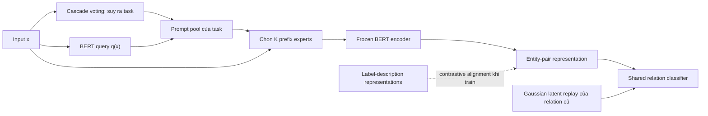

# WAVE++: Capturing Within-Task Variance for Continual Relation Extraction with Adaptive Prompting

## Tóm tắt một câu

WAVE++ mở rộng [[Adaptive Prompting for Continual Relation Extraction|WAVE-CRE]] bằng bốn mảnh ghép phối hợp: prompt pool riêng cho từng task để mô hình hóa biến thiên trong task, label descriptions để làm representation phân biệt hơn, cascade voting để suy ra task khi inference, và generative replay trên latent space để giữ classifier khỏi quên mà không lưu raw examples.

## Nguồn

- PDF gốc: [[Capturing Within-Task Variance for Continual Relation Extraction with Adaptive Prompting.pdf]]
- Bản xuất bản: [Neurocomputing 675 (2026), 132915](https://www.sciencedirect.com/science/article/pii/S0925231226003127)
- DOI: [10.1016/j.neucom.2026.132915](https://doi.org/10.1016/j.neucom.2026.132915)
- arXiv: [2505.13944v2](https://arxiv.org/abs/2505.13944)
- Code: [WAVE-CRE-PLUS-PLUS](https://github.com/PiDinosauR2804/WAVE-CRE-PLUS-PLUS)
- Phạm vi source local: PDF trong vault là bản arXiv v2 ngày 11-02-2026; metadata publication được đối chiếu thêm với bản Neurocomputing xuất bản ngày 28-04-2026. Bản arXiv rút gọn tên tác giả thành “Nam Le”, còn metadata journal ghi “Nam Le Hai”; frontmatter dùng tên theo bản journal.
- Quan hệ phiên bản: paper ghi rõ một phần công trình đã xuất hiện trong [[Adaptive Prompting for Continual Relation Extraction|WAVE-CRE]]; WAVE++ bổ sung label descriptions và cascade voting, đồng thời mở rộng phân tích/ablation. [[Capturing Within-Task Variance for Continual Relation Extraction with Adaptive Prompting.pdf#page=15|PDF, tr. 15]]

## Vấn đề paper giải quyết

Trong [[Continual Relation Extraction]] (CRE), model lần lượt nhận các task có tập relation rời nhau. Sau khi rời task cũ, model không còn truy cập dữ liệu của task đó nhưng vẫn phải phân loại trên toàn bộ relation đã thấy. [[Capturing Within-Task Variance for Continual Relation Extraction with Adaptive Prompting.pdf#page=4|PDF, tr. 4]]

Các prompt-based methods tránh lưu replay buffer nhưng vẫn có bốn điểm yếu:

1. **Forgetting trong shared parameters:** shared prompt, general prompt hoặc classifier tiếp tục đổi theo task mới.
2. **Sai task/prompt khi inference:** training biết task identity, test thì không; chọn sai prompt pool tạo train-test mismatch.
3. **Cross-task variance chưa đủ:** một shared prompt pool có thể cho các relation thuộc task khác nhau dùng cùng expert.
4. **Within-task variance chưa đủ:** một prompt cố định cho cả task không biểu diễn được các mode/context khác nhau trong cùng task.

Hai câu có context gần như giống nhau nhưng relation khác nhau có thể bị kéo về representation quá gần nếu dùng chung prompt. Đây là failure mode đặc biệt nguy hiểm trong relation extraction. [[Capturing Within-Task Variance for Continual Relation Extraction with Adaptive Prompting.pdf#page=2|PDF, tr. 2]]

## Research question

> Có thể xây một hệ CRE không lưu raw examples, vừa chọn đúng task khi inference, vừa giữ classifier ổn định qua task, vừa biểu diễn được biến thiên giữa và trong từng task hay không?

Paper tách xác suất dự đoán đúng thành hai nhân tử:

$$
P(\hat y=y\mid x)
=P(\hat y\in R_t\mid x)
\times P(\hat y=y\mid \hat y\in R_t,x)
$$

- Vế đầu: [[Task Identity Inference]] (TII) — xác định sample thuộc task nào.
- Vế sau: within-task prediction (WTP) — phân biệt relation bên trong task đã chọn.

WAVE++ thiết kế module riêng để cải thiện cả hai vế. [[Capturing Within-Task Variance for Continual Relation Extraction with Adaptive Prompting.pdf#page=4|PDF, tr. 4]]

## Đóng góp chính

- Diễn giải self-attention như nhiều [[Mixture of Experts|MoE]] dùng chung experts nhưng có các gates khác nhau; [[Prefix Tuning|prefix-tuning]] tương đương thêm các prefix experts mới vào attention.
- Dùng một [[Prompt Pool|prompt pool]] riêng cho mỗi task, mỗi prompt có độ dài $L=1$ để mỗi prefix expert có key riêng và được chọn độc lập theo input.
- Căn chỉnh input representation với label-description representations bằng [[Contrastive Learning|contrastive loss]].
- Thay task-classifier MLP bằng cascade voting dựa trên Mahalanobis distance, không cần train task predictor.
- Dùng Gaussian latent generators để replay representation cho classifier mà không lưu câu gốc.

## Phương pháp

### Mental model toàn hệ thống



Luồng inference gốc của paper nằm ở [[Capturing Within-Task Variance for Continual Relation Extraction with Adaptive Prompting.pdf#page=13|PDF, tr. 13]].

### 1. Prefix-tuning nhìn từ Mixture of Experts

Với prefix key/value $P^K,P^V$, prefix-tuning chèn prompt vào key và value của attention nhưng không thêm vào query. Backbone Transformer được đóng băng; chỉ prompt parameters được học. [[Capturing Within-Task Variance for Continual Relation Extraction with Adaptive Prompting.pdf#page=5|PDF, tr. 5]]

Paper chỉ ra output của một attention head có dạng weighted sum của các expert functions. Khi chèn $L$ prefix tokens, ta thêm $L$ prefix experts vào tập experts có sẵn. Đây là một **cách diễn giải toán học**, không có nghĩa mọi MoE implementation và prefix-tuning là hoàn toàn tương đương về capacity hay routing. [[Capturing Within-Task Variance for Continual Relation Extraction with Adaptive Prompting.pdf#page=6|PDF, tr. 6]] [[Capturing Within-Task Variance for Continual Relation Extraction with Adaptive Prompting.pdf#page=7|PDF, tr. 7]]

### 2. Task-specific prompt pool

Với task $t$, paper tạo pool:

$$
\mathcal P^t=\{(k^{(t)}_1,P^{(t)}_1),\ldots,(k^{(t)}_M,P^{(t)}_M)\}
$$

Query $q(x)$ từ frozen BERT được so với prompt keys bằng cosine similarity; top-$K$ prompts được chọn. Prompt-pool loss kéo query gần các key được chọn:

$$
\mathcal L_{pp}=\sum_{s\in K_x}\gamma(q(x),k^{(t)}_s)
$$

> [!warning] Quy ước similarity/distance chưa nhất quán
> Eq. 8 chọn bằng `argmin` và Eq. 10 được minimize, trong khi phần mô tả gọi $\gamma$ là cosine similarity. Hai cách viết chỉ nhất quán nếu $\gamma$ là cosine distance hoặc negative similarity; nếu là cosine similarity đúng nghĩa thì phải chọn `argmax`/maximize. Khi tái lập cần xem implementation để xác định dấu. [[Capturing Within-Task Variance for Continual Relation Extraction with Adaptive Prompting.pdf#page=8|PDF, tr. 8]] [[Capturing Within-Task Variance for Continual Relation Extraction with Adaptive Prompting.pdf#page=9|PDF, tr. 9]]

Điểm thiết kế đáng nhớ:

- **Pool riêng theo task** cô lập parameters, giảm interference giữa task.
- **Nhiều experts trong một task** cho phép input-dependent routing, nắm bắt within-task modes.
- **$L=1$ cho mỗi prompt** tránh buộc nhiều prefix experts chia sẻ một key; paper giữ tổng số experts bằng cách điều chỉnh $K$. [[Capturing Within-Task Variance for Continual Relation Extraction with Adaptive Prompting.pdf#page=9|PDF, tr. 9]] [[Capturing Within-Task Variance for Continual Relation Extraction with Adaptive Prompting.pdf#page=10|PDF, tr. 10]]

### 3. Label descriptions và contrastive alignment

Raw relation descriptions trong benchmark được đưa vào Gemini 1.5 để sinh các mô tả/Examples đa dạng. BERT mã hóa chúng thành $Des_r$. Với input có label $y$, contrastive loss kéo representation về descriptions đúng và đẩy khỏi descriptions của relation khác:

$$
\mathcal L_{cl}
=-\log
\frac{\sum_{d_y\in Des_y}\exp(f_\theta(x_p)\cdot d_y)}
{\sum_{r\in \hat R_t}\sum_{d_r\in Des_r}\exp(f_\theta(x_p)\cdot d_r)}
$$

Mục tiêu train task $t$:

$$
\min_{\mathcal P^t,\phi}
\mathcal L_{cls}+\alpha\mathcal L_{pp}+\beta\mathcal L_{cl}
$$

Chỉ prompt pool hiện tại và shared classifier được update; BERT và prompt pools cũ bị freeze. [[Capturing Within-Task Variance for Continual Relation Extraction with Adaptive Prompting.pdf#page=11|PDF, tr. 11]]

### 4. Cascade voting cho task identity

Mỗi prompt pool $\mathcal P^i$ biến input thành $z^i$. Với mỗi relation $r$ thuộc task $t$, paper xấp xỉ prompted representations bằng Gaussian $\mathcal N(\mu^i_{r,t},\Sigma^i_t)$. Một covariance được chia sẻ giữa các relation trong cùng task/pool để giảm số tham số.

Score của pool $i$ cho task $t$ là khoảng cách Mahalanobis nhỏ nhất tới một relation trong task đó:

$$
Score^i_t(x)=\min_{r\in R_t}
(z^i-\mu^i_{r,t})^\top(\Sigma^i_t)^{-1}(z^i-\mu^i_{r,t})
$$

Pool bỏ phiếu cho task có score nhỏ nhất. Cascade bắt đầu bằng BERT không prompt ($P_0$) và pool đầu tiên ($P_1$); nếu hai phiếu trùng thì dừng, nếu khác thì lấy majority vote từ một số pool bị chặn bởi $m=2$. [[Capturing Within-Task Variance for Continual Relation Extraction with Adaptive Prompting.pdf#page=12|PDF, tr. 12]] [[Capturing Within-Task Variance for Continual Relation Extraction with Adaptive Prompting.pdf#page=14|PDF, tr. 14]]

### 5. Generative replay trong latent space

Shared relation classifier vẫn có thể quên vì được update theo task mới. WAVE++ lưu mean/covariance của representation distribution cho từng relation và sample synthetic latent vector:

$$
z_r\sim\mathcal N(\mu^t_{r,t},\Sigma^t_t)
$$

Classifier được train lại trên các latent samples của toàn bộ relation đã thấy bằng cross-entropy. Vì vậy, cách gọi chính xác là **không lưu raw examples**, chứ không phải “không lưu gì”: model vẫn giữ prompt pools và thống kê phân phối. [[Capturing Within-Task Variance for Continual Relation Extraction with Adaptive Prompting.pdf#page=14|PDF, tr. 14]] [[Capturing Within-Task Variance for Continual Relation Extraction with Adaptive Prompting.pdf#page=15|PDF, tr. 15]]

## Experimental setup

| Thành phần | Thiết lập |
|---|---|
| Datasets | FewRel: 80 relations, 56.000 instances, chia 10 task; TACRED: 41 relations, 106.264 instances, chia 10 task, tối đa 320 train và 40 test samples/relation |
| Backbone | BERT; frozen encoder, train prompt pools và classifier |
| Metric | Average accuracy qua từng learning stage, trung bình 5 random runs |
| Rehearsal-free baselines | L2P, HiDe-Prompt, EoE, WAVE-CRE |
| Rehearsal-based baselines | RP-CRE, ACA, CRL, CDec, CEAR, RationaleCL, CREST, DP-CRE |
| Compute | Một NVIDIA A100; khoảng 6,8 giờ trên FewRel và 1,4 giờ trên TACRED theo time analysis |
| Trainable parameters | 3,5 triệu, ít hơn khoảng 0,3 triệu so với WAVE-CRE |

Nguồn setup và bảng thời gian: [[Capturing Within-Task Variance for Continual Relation Extraction with Adaptive Prompting.pdf#page=15|PDF, tr. 15]] [[Capturing Within-Task Variance for Continual Relation Extraction with Adaptive Prompting.pdf#page=16|PDF, tr. 16]] [[Capturing Within-Task Variance for Continual Relation Extraction with Adaptive Prompting.pdf#page=30|PDF, tr. 30]].

## Kết quả quan trọng

### Main results ở learning stage cuối

| Dataset | WAVE++ | WAVE-CRE | EoE | Rehearsal-based tốt nhất trong bảng |
|---|---:|---:|---:|---:|
| FewRel, $T_{10}$ | **87,7** | 85,0 | 85,5 | 85,1 |
| TACRED, $T_{10}$ | **82,5** | 78,7 | 81,5 | 80,8 |

WAVE++ hơn WAVE-CRE lần lượt 2,7 và 3,8 điểm accuracy ở stage cuối. So với rehearsal-free runner-up EoE, chênh lệch là 2,2 điểm trên FewRel và 1,0 điểm trên TACRED. [[Capturing Within-Task Variance for Continual Relation Extraction with Adaptive Prompting.pdf#page=16|PDF, tr. 16]]

### Ablation ở $T_{10}$

| Thành phần bỏ đi | FewRel | Đủ model | Chênh lệch | TACRED | Đủ model | Chênh lệch |
|---|---:|---:|---:|---:|---:|---:|
| Prompt pool → một prompt/task | 86,4 | 87,7 | +1,3 | 81,1 | 82,5 | +1,4 |
| Label descriptions | 85,8 | 87,7 | +1,9 | 80,7 | 82,5 | +1,8 |
| Generative replay | 62,1 | 87,7 | **+25,6** | 60,3 | 82,5 | **+22,2** |

Generative replay là thành phần có ảnh hưởng lớn nhất trong ablation; prompt pool và descriptions cho mức tăng nhỏ hơn nhưng nhất quán. [[Capturing Within-Task Variance for Continual Relation Extraction with Adaptive Prompting.pdf#page=18|PDF, tr. 18]] [[Capturing Within-Task Variance for Continual Relation Extraction with Adaptive Prompting.pdf#page=20|PDF, tr. 20]]

### Task prediction

Ở $T_{10}$, task prediction accuracy của WAVE++ so với WAVE-CRE là:

- FewRel: 88,3 so với 85,4 (+2,9).
- TACRED: 84,8 so với 79,2 (+5,6).

Khi task prediction sai, WAVE++ vẫn có tỉ lệ relation prediction đúng cao hơn WAVE-CRE, cho thấy label descriptions/prompt robustness có tác dụng ngoài task predictor. [[Capturing Within-Task Variance for Continual Relation Extraction with Adaptive Prompting.pdf#page=19|PDF, tr. 19]] [[Capturing Within-Task Variance for Continual Relation Extraction with Adaptive Prompting.pdf#page=29|PDF, tr. 29]]

### Các kiểm tra bổ sung đáng giữ

- $L=1,K=8$ cho kết quả tốt nhất trong sweep giữ tổng 8 prefix experts, nhưng chênh lệch $T_{10}$ trên TACRED so với $L=8,K=1$ chỉ 0,2 điểm; hiệu ứng có thật nhưng không lớn ở riêng stage cuối. [[Capturing Within-Task Variance for Continual Relation Extraction with Adaptive Prompting.pdf#page=19|PDF, tr. 19]]
- Một generated description đã đủ mạnh; tăng lên 3–7 descriptions không tiếp tục cải thiện nhất quán. [[Capturing Within-Task Variance for Continual Relation Extraction with Adaptive Prompting.pdf#page=27|PDF, tr. 27]]
- Royston tests trên tám class của **một task đại diện** trong FewRel đều có $p>0,05$, nên chưa bác bỏ Gaussian assumption trong slice đó; kết quả không chứng minh mọi task/dataset đều Gaussian. [[Capturing Within-Task Variance for Continual Relation Extraction with Adaptive Prompting.pdf#page=27|PDF, tr. 27]] [[Capturing Within-Task Variance for Continual Relation Extraction with Adaptive Prompting.pdf#page=28|PDF, tr. 28]]
- Paired t-tests trên 5 runs báo $p<0,05$ khi so với WAVE-CRE, HiDe-Prompt và EoE trên cả hai datasets. [[Capturing Within-Task Variance for Continual Relation Extraction with Adaptive Prompting.pdf#page=29|PDF, tr. 29]]

## Trade-off chi phí

| Method | Train TACRED/FewRel (giờ) | Inference TACRED/FewRel (ms) |
|---|---:|---:|
| EoE | 1,2 / 6,5 | 39,5 / 40,6 |
| WAVE-CRE | 2,5 / 7,4 | 28,7 / 29,8 |
| WAVE++ | 1,4 / 6,8 | 40,5 / 41,2 |

Cascade voting bỏ chi phí train task predictor nhưng phải chạy thêm prompt pools/distribution scoring khi inference. WAVE++ vì thế train nhanh hơn WAVE-CRE nhưng inference chậm hơn khoảng 12 ms trong setup của paper. [[Capturing Within-Task Variance for Continual Relation Extraction with Adaptive Prompting.pdf#page=30|PDF, tr. 30]]

## Hạn chế và giả định

### Paper tự nêu

- Hiệu quả phụ thuộc mạnh vào thiết kế prompt pool và prefix experts.
- Prefix experts hiện vẫn là các hàm khá đơn giản; capacity còn hạn chế.
- Chọn sai prompt pool ở test có thể làm forgetting xuất hiện lại.
- Giữ kiến thức cũ vẫn chưa được giải quyết hoàn toàn. [[Capturing Within-Task Variance for Continual Relation Extraction with Adaptive Prompting.pdf#page=20|PDF, tr. 20]]

### Đánh giá của tôi từ evidence

- **Không phải zero-memory:** raw data không được lưu, nhưng Gaussian statistics, prompt pools và classifier parameters vẫn mang thông tin quá khứ; paper chưa đo memory growth đầy đủ theo số task/relation.
- **Privacy là động cơ, chưa phải kết luận:** không lưu raw examples giảm một loại rủi ro, nhưng paper không làm membership inference, reconstruction attack hay privacy guarantee.
- **Task boundaries được biết khi train:** mỗi dataset/task có relation sets rời nhau và task hiện tại được cung cấp; đây chưa phải online/open-world CRE với boundary mơ hồ.
- **Label description phụ thuộc LLM ngoài:** chất lượng, chi phí và reproducibility chịu ảnh hưởng bởi model/prompt sinh description; paper dùng Gemini 1.5 nhưng không so nhiều generators.
- **Gaussian validation hẹp:** normality test chỉ được báo cho tám class của một FewRel task đại diện.
- **Ký hiệu routing mơ hồ:** `argmin`/cosine similarity trong Eq. 8–10 cần đối chiếu implementation trước khi tái lập.
- **TACRED là dataset lệch lớp và có `no_relation`:** giới hạn 320/40 samples mỗi relation và cách chia 10 task ảnh hưởng mức độ gần thực tế; cần xem code để tái lập chính xác preprocessing.

## WAVE++ khác WAVE-CRE ở đâu?

| Thành phần | WAVE-CRE | WAVE++ |
|---|---|---|
| Task-specific prompt pools | Có | Có, phân tích sâu hơn theo sparse-MoE |
| Label descriptions | Không | Có, contrastive alignment |
| Task prediction | Train MLP relation/task predictor | Cascade voting, không train predictor |
| Generative consolidation | Gaussian latent replay | Giữ lại và phân tích/ablate sâu hơn |
| Trainable parameters | 3,8M | 3,5M |
| Điểm mạnh | Inference thấp hơn | Accuracy/task prediction tốt hơn, train nhanh hơn |
| Đổi lại | Task predictor dễ drift | Voting làm inference chậm và lưu nhiều distributions hơn |

## Tôi hiểu được gì

Điểm mạnh nhất của WAVE++ không phải “thêm prompt”, mà là **phân công bốn failure modes cho bốn cơ chế khác nhau**:

```text
Interference giữa task   -> prompt pools tách biệt
Đa dạng trong một task   -> input-dependent prefix experts
Sai task khi inference   -> cascade voting
Classifier quên relation -> latent generative replay
Representation dễ overfit -> label-description contrastive loss
```

Điều này cũng giải thích ablation: prompt pool và descriptions cải thiện representation vài điểm, còn replay trực tiếp bảo vệ shared classifier nên khi bỏ đi kết quả sụp hơn 22 điểm.

## Khi nào ý tưởng này hữu ích?

- Dữ liệu cũ không thể lưu vì policy hoặc dung lượng, nhưng được phép giữ learned parameters/statistics.
- Relation taxonomy mở rộng theo các đợt có boundary rõ.
- Có relation descriptions đủ tốt để tạo semantic anchors.
- Inference latency tăng là chấp nhận được đổi lấy accuracy và không train task predictor.

Không nên áp dụng nguyên xi khi stream không có task boundaries, relation overlap giữa task, privacy cần bảo đảm hình thức, hoặc latency budget rất chặt.

## Câu hỏi review

1. Vì sao một shared prompt pool có thể làm giảm cross-task variance?
2. Vì sao một prompt duy nhất cho mỗi task không đủ nắm bắt within-task variance?
3. $L=1$ thay đổi quan hệ giữa prompt key và prefix expert như thế nào?
4. WAVE++ cải thiện TII và WTP bằng các module nào?
5. Cascade voting khác task-classifier MLP ở train cost, inference cost và failure mode nào?
6. Vì sao WAVE++ vẫn cần generative replay dù các prompt pool cũ đã bị freeze?
7. “Không lưu raw data” khác “không dùng memory” ở đâu?
8. Bằng chứng nào ủng hộ Gaussian assumption, và bằng chứng đó còn hẹp ở đâu?

## Gợi ý trả lời câu hỏi review

1. Nếu các task dùng chung prompts, update từ task mới có thể ghi đè expert đã phục vụ task cũ; các context gần nhau còn có thể chọn cùng prompt dù relation khác.
2. Một prefix expert cố định có capacity hạn chế và không đổi theo input; nhiều experts được route theo query cho phép chuyên môn hóa theo các mode trong task.
3. Mỗi expert có key riêng thay vì nhiều experts bị buộc dùng chung một key, nên routing linh hoạt hơn.
4. Prompt pools + label descriptions cải thiện WTP; cascade voting cải thiện TII; latent replay bảo vệ shared classifier tác động đến cả accuracy chung.
5. MLP cần train và có thể drift theo task mới nhưng inference rẻ; voting không train predictor, ổn định hơn trong kết quả paper nhưng cần nhiều forward/distance computations khi test.
6. Prompt cũ giữ task-specific representation, nhưng shared classifier vẫn được update trên label mới và sinh bias/forgetting; replay giữ decision boundary cho relation cũ.
7. WAVE++ không giữ câu gốc nhưng vẫn giữ prompt parameters và mean/covariance distributions; đó vẫn là memory ở dạng mô hình/thống kê.
8. t-SNE và Royston tests trên tám class của một FewRel task ủng hộ xấp xỉ Gaussian ở slice đó, chưa đủ tổng quát hóa cho mọi task/dataset.

## Câu hỏi nghiên cứu tiếp theo

- [ ] Memory và latency scale như thế nào khi tăng từ 10 lên hàng trăm task?
- [ ] Có thể thay Gaussian bằng mixture density hoặc non-parametric generator mà không làm memory tăng quá nhanh không?
- [ ] Có thể joint-route task và prompt experts một lần, thay vì cascade nhiều forward passes không?
- [ ] Label descriptions do người viết, LLM sinh và retrieval từ ontology khác nhau thế nào?
- [ ] Latent statistics có rò rỉ membership hoặc cho phép reconstruction không?
- [ ] Phương pháp còn hiệu quả khi relation sets giữa task overlap hoặc task boundary không được cung cấp không?

## Liên quan đến

- [[Adaptive Prompting for Continual Relation Extraction]]
- [[Continual Learning]]
- [[Catastrophic Forgetting]]
- [[Continual Relation Extraction]]
- [[Prompt Pool]]
- [[Prefix Tuning]]
- [[Mixture of Experts]]
- [[Task Identity Inference]]
- [[Replay in Continual Learning]]
- [[Contrastive Learning]]
- [[Relation Extraction]]

## Evidence map theo PDF

| Nội dung | Trang PDF |
|---|---|
| Motivation, gap, đóng góp | 1–3 |
| CRE/TII/WTP và background | 4–8 |
| Task-specific prompt pool | 9–10 |
| Label descriptions và loss | 10–11 |
| Cascade voting | 12–14 |
| Generative replay và setup | 14–16 |
| Main results và ablation | 16–20 |
| Appendix: MoE, descriptions, Gaussian, significance, time | 25–30 |
